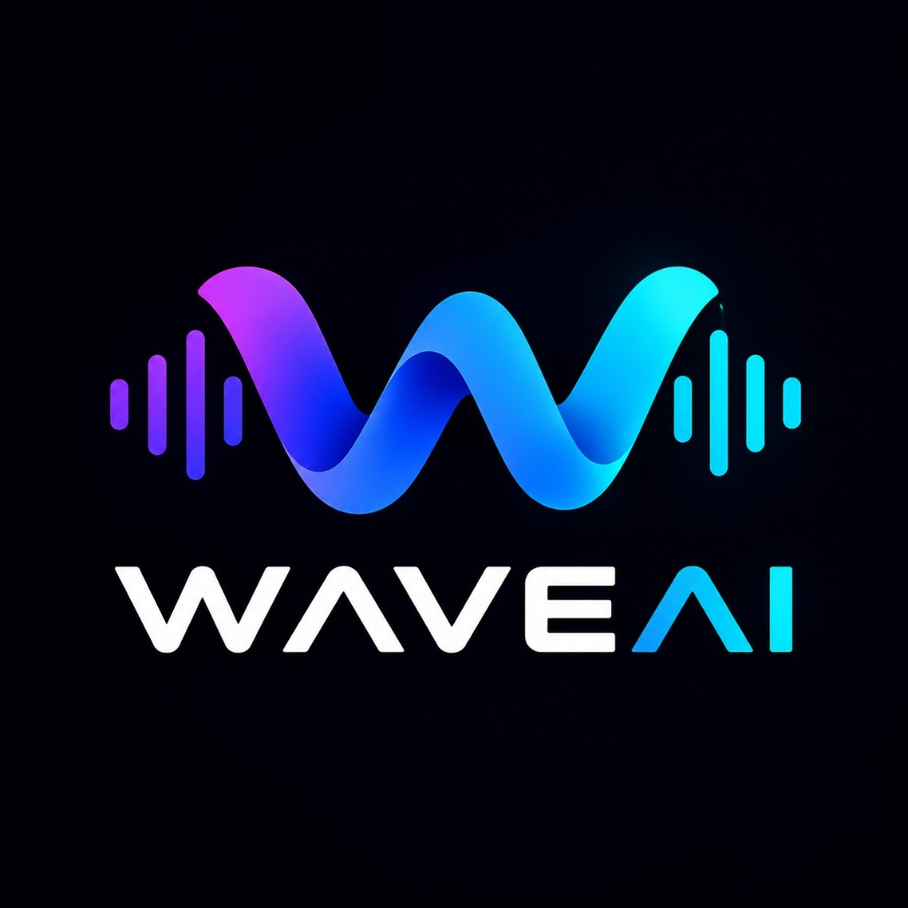

<div align="center">



# WaveAI

**Estudio de mastering asistido por IA + Live Engine Web Audio.**

<sub>La onda púrpura→cian es la marca, el favicon y el icono de la app.</sub>

</div>

---

## Qué es

WaveAI es una sola interfaz de mastering IA:

1. **Studio de mastering IA** — subes un WAV/MP3, el backend analiza (loudness, espectro, tempo, género) y corre una cadena DSP de 13 etapas para entregar un master profesional con player **A/B** (original vs masterizado).
2. **Live Engine** — el master se carga en un motor Web Audio en el navegador con FX en tiempo real.

**La unión:** WaveAI masteriza primero (offline, una vez). El master se carga en un **Live Engine** (Web Audio API en el navegador) con FX en tiempo real (filtro → drive → delay/echo → reverb), operado **standalone** desde los knobs de la UI — sin WebSocket ni MIDI (el bridge y el simulator fueron removidos). Todo en la pestaña **"Live"** del studio.

```
Knobs UI → LiveParams → Studio Live Engine (Web Audio) → Knobs/Meters/Audio
```

## Mapa del repo

| Ruta | Stack | Rol |
|---|---|---|
| `apps/studio/` | Next.js 16 + React 19 + TS + Tailwind 4 | Mastering UI + pestaña Live (Web Audio) |
| `apps/audiomind/` | Python/FastAPI, librosa, pedalboard | DSP de mastering + Mix Engine (análisis + cadena de 13 etapas) |
| `packages/contracts/` | JSON Schema + generador | `live_params.schema.json` = fuente de verdad |
| `e2e/` | Playwright | master → live |
| `docs/` | Markdown | Especificaciones, setup, reportes de integración — índice central en [`docs/README.md`](docs/README.md) + [`docs/ESTADO_PROYECTO.md`](docs/ESTADO_PROYECTO.md) |

## Compliance Phase 1 (feature destacada)

Documentada en detalle en [`docs/reference/COMPLIANCE_PHASE1.md`](docs/reference/COMPLIANCE_PHASE1.md). Agrega al motor y a la UI:

- **Modo Transparente** (`processing_mode: "transparent"`): passthrough bit-exacto — si ningún parámetro cambia el audio, el master es idéntico al original (regla "neutral = bypass").
- **`platform_target`**: `spotify`, `apple_music`, `youtube`, `tidal`, `custom` — aplica defaults de loudness/ceiling (Spotify → −14 LUFS / −1.0 dBTP, Apple Music → −16 / −1.0, etc.) con espejo en la UI vía `PLATFORM_DEFAULTS`.
- **`output_sr` / `output_bit_depth`**: `same_as_input`, `44100`, `48000`, `96000` y bits (default 24). Round-trip 48k → 44.1k verificado.
- **`strict_mode`**: si el material viene dañado (clipping / true peak ≥ −0.3 dBTP) el backend rechaza con HTTP 422 y el frontend muestra el detalle (antes lo perdía).

### UI del studio

- **8 presets de carácter**: Pulido, Brutal, Cristalino, Vintage, Crudo, Envolvente, Épico, Muro — cada uno con género, descripción y tooltip; la cache de masters por preset hace instantáneo volver a uno ya escuchado (se limpia automáticamente al cambiar de track — fix `f25f7e8`).
- **Panel de entrega flotante**: FAB "Entrega" (abajo a la derecha) → modo/plataforma/SR/bits/QC estricto en un sheet que no ensucia el lienzo.
- **Reporte del motor flotante**: píldora compacta abajo a la izquierda con `LUFS · dBTP · SR · bits` que se expande a la tarjeta completa (`MasteringReportCard`).
- **Chip de track con género**: en la navbar muestra el **género detectado** (reggaetón, pop, rock…) en vez del UUID interno del archivo.
- **Marca WaveAI**: textos visibles (navbar, welcome gate, drawer, guía, compartir) — los assets `public/brand/WaveAI.svg` y `WaveAI.png` alimentan la tarjeta de compartir. El favicon/icono es la onda púrpura→cian (`src/app/icon.jpg` + `apple-icon.jpg`, fuente en `public/brand/waveai-logo.jpg`).
- **Acceso directo sin login**: el studio no tiene flujo de autenticación — entra directo al mastering tras el welcome gate (la ruta `/login`, el middleware y los componentes de auth fueron removidos; `convex/auth.ts` queda disponible para un futuro login real).

## Cómo correr localmente

Sigue literal `docs/runbooks/SETUP.md` si el entorno no está levantado (venv, bun, stack local, pitfalls reales).

```bash
# Backend (DSP de mastering)
cd apps/audiomind && uvicorn audiomind.main:app --port 8000
# → http://localhost:8000/health = {"status":"ok","service":"AudioMind"}

# Frontend (studio)
cd apps/studio && bun install && bun run dev
# → http://localhost:3000
```

**Windows — un solo click** (`scripts/`): doble click en `scripts\start\start-all.bat` hace todo — si falta el entorno corre el setup primero (`.venv`, deps Python, `bun install`, build de `apps/agent`, `.env.local`) y luego levanta backend + studio en ventanas separadas con health checks incluidos. `scripts\stop\stop-all.bat` los detiene. Opciones: `scripts\setup\setup.bat` corre solo el setup.

**Docker** (sin instalar Python/bun en el host):

```bash
docker compose up --build   # studio :3000 + audiomind :8000
```

Detalles y decisiones (volúmenes, build-args): `docs/runbooks/DOCKER.md`.

## Verificación

```bash
# Backend
cd apps/audiomind && pytest tests/ -q
uvicorn audiomind.main:app --port 8000           # → curl localhost:8000/health

# Studio (lint + build)
cd apps/studio && npm run lint && npm run build

# e2e
npm run e2e                                               # desde apps/studio
```

> Nota lint: `eslint src` reporta 0 errores (34 warnings no-funcionales). Los errores históricos fueron corregidos con el patrón de ajuste de estado durante render / lazy init (`useRole.ts` ya no existe — removido junto al flujo de login).

## Reglas no negociables

- **`packages/contracts/live_params.schema.json` es la fuente de verdad** del protocolo — regenera tipos con `packages/contracts/scripts/gen_types.sh`, nunca edites los generados a mano.
- **Neutral = bypass**: parámetro neutral = audio idéntico (bit-exacto en backend, defaults del schema en Live Engine).
- **El audio NUNCA viaja por WebSocket** — el Live Engine es **standalone** (knobs de la UI → `LiveParams`): no hay socket, ni MIDI, ni bridge (removidos).
- **`setTargetAtTime` siempre** (nunca asignación directa en Web Audio — anti-zipper).
- **Microcopy en español latino neutro/colombiano** (sin voseo): "Sube tu audio", "Ajusta", "Prueba de nuevo".
- **Commits semánticos** (`feat:`, `fix:`, `test:`, `docs:`, `chore:`), sin atribución AI.

## Advertencias operativas (importantes)

- **Sesiones en memoria** (dict + `SessionCache`): se pierden al reiniciar el backend, salvo el espejo best-effort a `uploads/sessions.json`. En Railway solo sobreviven si hay volume montado en `/app/uploads`.
- **`outputs/` NO está en el volume**: los masters generados (`{session_id}_mastered.wav`) se pierden en un redeploy aunque los uploads sobrevivan. Pendiente de decisión: historial/retención de sesiones.
- **Frontend** restaura 1 sola sesión desde `localStorage` (`waveai-session`); si el backend no la tiene → aviso "Tu sesión anterior expiró".

## Convenciones

- Commits semánticos; tests junto al código; no romper la suite existente.
- Backend: `pyproject` con ruff + mypy strict.
- WAV/MP3 de prueba van a `uploads/`/`outputs/` (gitignored) o se generan con `apps/audiomind/scripts/generate_samples.py` y `e2e/fixtures/generate_fixture.py`.