# AudioMind Intelligence — Knowledge Core

**Módulo**: `backend/src/audiomind/intelligence/`
**Fase**: 1 — Infraestructura de Conocimiento (pre-ML)
**Versión**: 1.0.0

---

## ¿Qué es Knowledge Core?

Knowledge Core es el **cerebro de conocimiento de AudioMind**. Es un módulo completamente independiente del procesamiento DSP que define la estructura, el formato y las reglas mediante las cuales AudioMind almacena todo lo que sabe sobre mastering, música, plugins, presets, experimentos y negocio.

No es código de procesamiento de audio. No es una base de datos vectorial. No es un modelo de IA. Es la **fuente de verdad estructurada** que hace que AudioMind pase de ser un "efecto de audio con presets" a un "ecosistema de inteligencia musical" capaz de aprender, razonar y mejorar con el tiempo.

### ¿Por qué existe?

Porque sin una base de conocimiento estructurada, todo lo que AudioMind aprende se pierde cuando termina la sesión. Los presets existen en código, pero no hay registro de por qué se eligieron esos parámetros, qué experimentos los validaron, para qué géneros funcionan mejor, ni cómo mejorar en la próxima versión.

Knowledge Core existe para que AudioMind pueda responder estas preguntas:

- ¿Por qué el preset Brutal usa compresor FET con attack de 0.5ms?
- ¿Qué géneros funcionan mejor con el preset Envolvente?
- ¿Qué experimento validó el ceiling dinámico basado en crest factor?
- ¿Cuál fue el resultado de probar saturación tube vs tape en trap?
- ¿Qué ideas de features están evaluándose ahora?
- ¿Qué feedback de usuarios ya se analizó y qué decisión se tomó?

### ¿Qué problema resuelve?

| Problema | Solución Knowledge Core |
|---|---|
| El conocimiento de mastering vive en la cabeza del dev | Documentación estructurada, versionada en Git, consultable por agentes |
| Cada preset es solo código sin justificación | `knowledge/presets/` con objetivo, problema, métricas, experimentos asociados |
| No hay trazabilidad entre decisiones técnicas | `knowledge/roadmap/` con ADRs, experiments vinculados a presets |
| No hay memoria de experimentos fallidos | `knowledge/experiments/` registra resultados positivos y negativos |
| Los agentes de IA futuros no tienen contexto | Knowledge Core es la fuente de verdad que alimenta RAG |
| Ideas de mejora se pierden en conversaciones | `ideas/` captura, estructura y prioriza cada idea con ciclo de vida |
| No hay forma de medir mejora continua | Schemas Pydantic definen métricas por preset, género, experimento |

---

## Arquitectura

```
backend/src/audiomind/intelligence/
│
├── __init__.py                 # Entry point del módulo
├── README.md                   # Este documento
│
├── knowledge/                  # ★ FUENTE DE VERDAD — Dominios de conocimiento
│   ├── presets/                #   Definiciones canónicas de presets
│   ├── plugins/                #   Specs de plugins DSP (saturation, comp, eq, limiter)
│   ├── genres/                 #   Perfiles técnicos de géneros musicales
│   ├── mastering/              #   Pipeline, target curves, estándares de entrega
│   ├── metrics/                #   Definiciones de métricas y su interpretación
│   ├── philosophy/             #   Principios de diseño, ética, tradeoffs
│   ├── roadmap/                #   Fases, ADRs, milestones planning
│   ├── business/               #   ICP, pricing, competencia, unit economics
│   └── experiments/            #   Registro de experimentos con resultados
│
├── ideas/                      # ★ CAPTURA — Ideas y mejoras propuestas
│   └── README.md               #   Ciclo de vida: idea → experimento → roadmap
│
├── memory/                     # ★ MEMORIA FUTURA — Arquitectura documentada
│   └── README.md               #   STM, LTM, Semantic, Procedural, Research, Business
│
├── templates/                  # ★ FORMATOS — Plantillas estandarizadas
│   ├── preset.template.md      #   Template para documentar presets
│   ├── plugin.template.md      #   Template para documentar plugins
│   ├── genre.template.md       #   Template para perfiles de género
│   ├── experiment.template.md  #   Template para registrar experimentos
│   └── idea.template.md        #   Template para capturar ideas
│
└── schemas/                    # ★ MODELOS — Estructuras de datos Pydantic
    ├── __init__.py
    ├── preset_knowledge.py     #   PresetKnowledge, PluginRef, PresetMetrics
    ├── plugin_knowledge.py     #   PluginKnowledge con parámetros y tipos
    ├── genre_knowledge.py      #   GenreKnowledge con perfil técnico
    ├── experiment_knowledge.py #   ExperimentKnowledge con hipótesis y resultados
    └── idea_knowledge.py       #   IdeaKnowledge con priorización y estado
```

---

## Diferencias clave con el procesamiento DSP

| Aspecto | Procesamiento DSP | Knowledge Core |
|---|---|---|
| **Propósito** | Transformar audio | Almacenar conocimiento |
| **Input** | Señal de audio (WAV, float array) | Documentos Markdown + schemas Pydantic |
| **Output** | Audio masterizado | Consultas estructuradas para agentes |
| **Estado** | Stateless (cada sesión empieza de cero) | Stateful (acumula conocimiento) |
| **Persistencia** | Archivos de audio temporales | Git + futura Vector DB |
| **Consumidores** | Frontend (WaveSurfer, descargas) | Agentes IA (Chief, DSP, Research, Innovation, Product) |
| **Evolución** | Parámetros fijos por preset | Documentación versionada, experimentos, mejora continua |
| **Testing** | LUFS, True Peak, escucha | Validación de schemas, consistencia cross-doc |

**Regla fundamental**: Knowledge Core nunca toca audio. DSP nunca escribe en Knowledge Core directamente. La comunicación entre ambos dominios ocurre a través de agentes (Chief Audio Engineer, DSP Designer) que leen conocimiento para decidir parámetros y escriben experimentos para registrar resultados.

---

## Hoja de ruta de integración

### Fase 1 — Knowledge Core (actual)
- [x] Estructura de carpetas y módulo Python
- [x] README principal (este documento)
- [x] Schemas Pydantic para 5 tipos de conocimiento
- [x] Templates Markdown para 5 tipos de conocimiento
- [x] 9 dominios de conocimiento con READMEs
- [x] Arquitectura de memoria documentada (6 tipos)
- [x] Sistema de ideas con ciclo de vida

### Fase 2 — Contenido (próximo)
- [ ] Población inicial de `knowledge/presets/` con 8 presets canónicos
- [ ] Población de `knowledge/plugins/` con schemas de plugins DSP
- [ ] Población de `knowledge/genres/` con perfiles técnicos
- [ ] Población de `knowledge/mastering/` con pipeline y target curves
- [ ] ADRs iniciales en `knowledge/roadmap/`

### Fase 3 — RAG (ML)
- [ ] Indexación de `knowledge/` en Vector DB (Chroma / Pinecone / Milvus)
- [ ] Embeddings de documentos Markdown chunked
- [ ] API de consulta RAG para agentes
- [ ] Retrieval Augmented Generation sobre conocimiento curado

### Fase 4 — Agentes
- [ ] Chief Audio Engineer Agent (lectura: knowledge/, escritura: experiments/)
- [ ] DSP Designer Agent (lectura: plugins/, mastering/; escritura: presets/)
- [ ] Research Agent (lectura: papers, escritura: experiments/)
- [ ] Innovation Agent (lectura: ideas/, business/; escritura: ideas/)
- [ ] Product Strategist Agent (lectura: business/, roadmap/; escritura: roadmap/)

### Fase 5 — Memoria persistente
- [ ] PostgreSQL + pgvector para LTM + Semantic Memory
- [ ] Redis para STM (memoria de sesión)
- [ ] APIs `memory.read()`, `memory.write()`, `memory.consolidate()`
- [ ] Nightly consolidation: STM → LTM → Semantic extraction
- [ ] Governance: Chief Agent como curador, Research Agent dueño de Research Memory

---

## Diagrama de arquitectura

```mermaid
graph TD
    User(["🎧 Usuario"])
    Frontend(["🖥️ Frontend Next.js"])

    subgraph Backend ["Backend FastAPI"]
        DSP["🔊 DSP Engine<br/>(procesamiento de audio)"]
        API["🌐 API Routes<br/>(upload, master, download, license)"]
    end

    subgraph KC ["Knowledge Core (intelligence/)"]
        direction TB
        K_Presets["knowledge/presets/"]
        K_Plugins["knowledge/plugins/"]
        K_Genres["knowledge/genres/"]
        K_Mastering["knowledge/mastering/"]
        K_Metrics["knowledge/metrics/"]
        K_Philosophy["knowledge/philosophy/"]
        K_Roadmap["knowledge/roadmap/"]
        K_Business["knowledge/business/"]
        K_Experiments["knowledge/experiments/"]
        Ideas["ideas/"]
        Schemas["schemas/ (Pydantic)"]
        Templates["templates/ (Markdown)"]
    end

    subgraph Future ["Futuro (Fases 3-5)"]
        VectorDB["🧠 Vector DB<br/>(Chroma / Pinecone)"]
        RAG["📡 RAG Pipeline<br/>(Retrieval-Augmented Gen)"]
        Memory["💾 Memory System<br/>(STM / LTM / Semantic / etc.)"]
    end

    subgraph Agents ["Agentes IA (Fase 4+)"]
        Chief["👑 Chief Audio Engineer"]
        DSPDesigner["🔧 DSP Designer"]
        Research["🔬 Research Agent"]
        Innovation["💡 Innovation Agent"]
        Product["📊 Product Strategist"]
    end

    User --> Frontend
    Frontend --> API
    API --> DSP
    DSP -.->|"escribe resultados"| K_Experiments
    KC -->|"alimenta"| RAG
    RAG -->|"contexto para"| Agents
    Chief -->|"lee"| K_Presets
    Chief -->|"lee"| K_Mastering
    Chief -->|"lee"| K_Philosophy
    Chief -->|"escribe"| K_Experiments
    DSPDesigner -->|"lee/escribe"| K_Plugins
    DSPDesigner -->|"escribe"| K_Presets
    Research -->|"escribe"| K_Experiments
    Research -->|"lee"| K_Metrics
    Innovation -->|"lee/escribe"| Ideas
    Innovation -->|"lee"| K_Business
    Product -->|"lee/escribe"| K_Roadmap
    Product -->|"lee"| K_Business
    K_Presets -.-> VectorDB
    K_Plugins -.-> VectorDB
    K_Genres -.-> VectorDB
    K_Mastering -.-> VectorDB
    K_Metrics -.-> VectorDB
    K_Experiments -.-> VectorDB
    Ideas -.-> VectorDB
    VectorDB --> RAG
    Memory -->|"STM para"| Chief
    Memory -->|"LTM para"| Chief
    Memory -->|"Research para"| Research

    classDef future fill:#1a1a2e,stroke:#4a4a6a,stroke-dasharray: 5 5
    classDef kc fill:#0d1b2a,stroke:#1b3a5c
    classDef agents fill:#2d1b2a,stroke:#5c1b3a
    classDef backend fill:#1a2d1a,stroke:#3a5c3a
    class VectorDB,RAG,Memory future
    class K_Presets,K_Plugins,K_Genres,K_Mastering,K_Metrics,K_Philosophy,K_Roadmap,K_Business,K_Experiments,Ideas,Schemas,Templates kc
    class Chief,DSPDesigner,Research,Innovation,Product agents
    class DSP,API,Frontend backend
```



---

## Principios de diseño

### 1. Separación total de concerns

Knowledge Core **no sabe** que existe procesamiento de audio. DSP **no sabe** que existe Knowledge Core. La comunicación es siempre a través de agentes o APIs explícitas. Esto permite que cada dominio evolucione independientemente.

### 2. Fuente de verdad en Git

Todo el conocimiento canónico vive en archivos Markdown versionados en Git. No hay BD oculta, no hay estado efímero. Cada cambio es revisable, reversible, auditable.

### 3. Esquemas primero (Schema-first)

Los modelos Pydantic en `schemas/` definen la estructura de cada tipo de conocimiento antes de que exista el contenido. Esto garantiza que cualquier documento Markdown se pueda validar, parsear y eventualmente indexar sin ambigüedad.

### 4. Escalabilidad horizontal

Knowledge Core soporta desde 1 preset hasta 10,000 documentos. La misma estructura que hoy almacena 8 presets manuales mañana alimentará una vector DB con millones de embeddings. No hay nada que cambiar — solo agregar.

### 5. Preparado para IA, no dependiente de IA

Knowledge Core es completamente funcional sin Machine Learning. Los agentes humanos (vos) pueden leer, escribir y mantener el conocimiento hoy. Cuando lleguen los modelos, los agentes IA leerán exactamente los mismos archivos.

---

## Aprendizaje continuo

El ciclo de aprendizaje de AudioMind está definido por Knowledge Core:

```
                    +-----------------------------+
                    |   Feedback / Experiment      |
                    |   (usuario, research, dev)    |
                    +-------------+----------------+
                                  |
                                  v
                    +-----------------------------+
                    |   ideas/                     |
                    |   (captura estructurada)     |
                    +-------------+----------------+
                                  | evaluacion
                                  v
                    +-----------------------------+
                    |   knowledge/experiments/     |
                    |   (hipotesis -> resultados)  |
                    +-------------+----------------+
                                  | validacion
                                  v
                    +-----------------------------+
                    |   knowledge/presets/         |
                    |   knowledge/plugins/         |
                    |   knowledge/genres/          |
                    |   (mejora de conocimiento)   |
                    +-------------+----------------+
                                  |
                                  v
                    +-----------------------------+
                    |   DSP Engine                 |
                    |   (implementa mejora)        |
                    +-------------+----------------+
                                  |
                                  v
                    +-----------------------------+
                    |   User feedback -> ciclo     |
                    +-----------------------------+
```

Cada vuelta del ciclo produce un preset mejor, un parametro mas afinado, un experimento mas informativo. Knowledge Core es el registro historico de ese progreso.

---

## Para empezar a usar

```bash
# 1. Leer la estructura
tree backend/src/audiomind/intelligence/

# 2. Explorar un dominio
cat backend/src/audiomind/intelligence/knowledge/mastering/README.md

# 3. Crear un preset documentado:
#    - Copiar templates/preset.template.md -> knowledge/presets/<id>.md
#    - Completar todos los campos
#    - Opcional: agregar experimento en knowledge/experiments/

# 4. Registrar un experimento:
#    - Copiar templates/experiment.template.md -> knowledge/experiments/EXP-XXX.md
#    - Completar hipotesis, cambios, resultados

# 5. Capturar una idea:
#    - Leer ideas/README.md para el ciclo de vida
#    - Crear ideas/IDEA-XXX_titulo.md usando templates/idea.template.md
```

---

*Knowledge Core no es un proyecto de IA. Es un proyecto de ingenieria de conocimiento. La IA vendra despues, y encontrara una base solida.*
