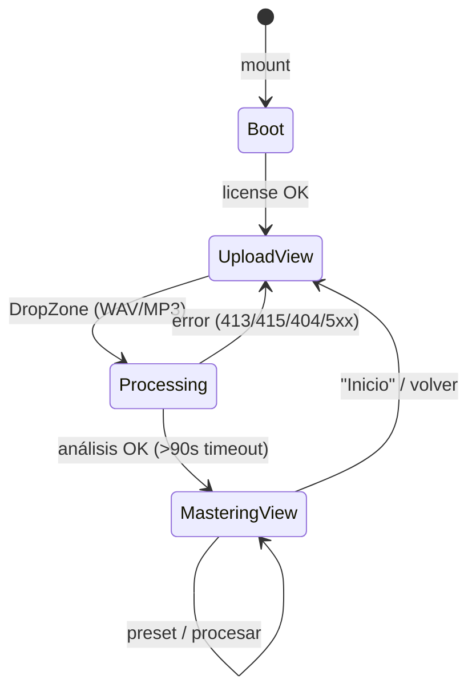
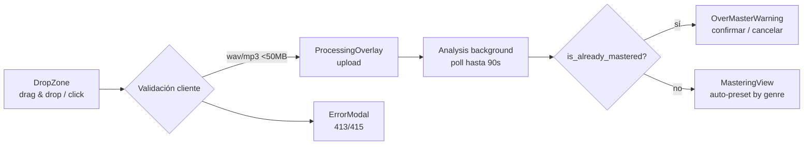
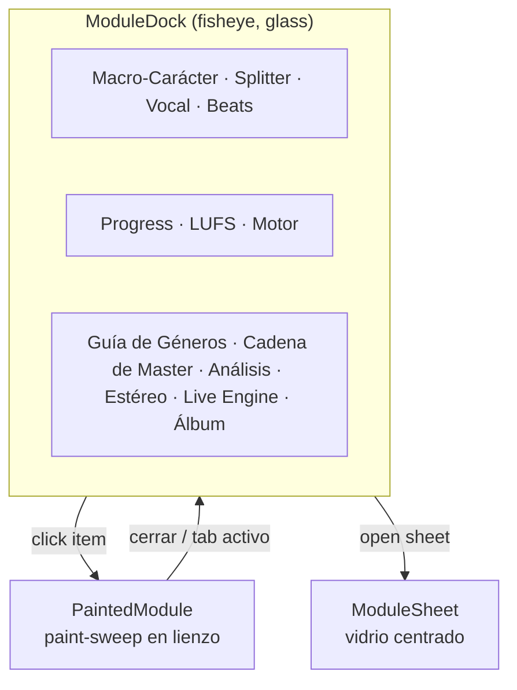
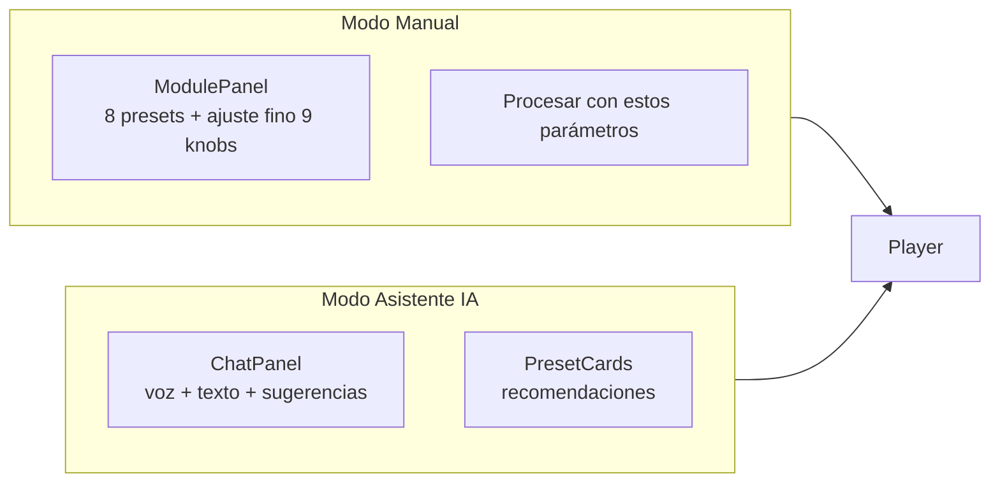
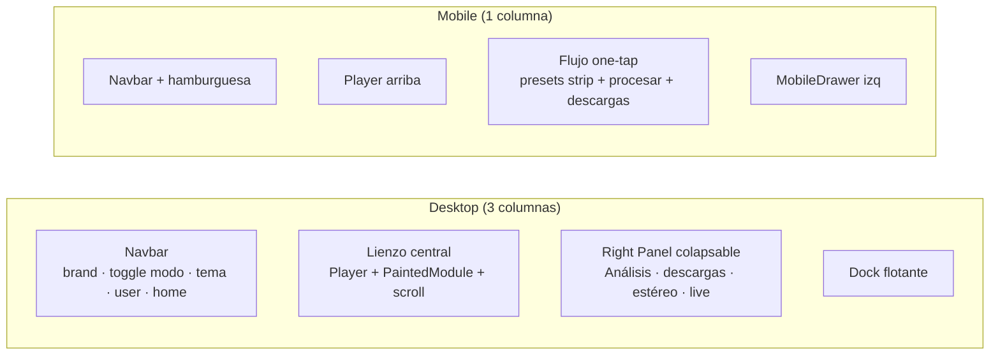
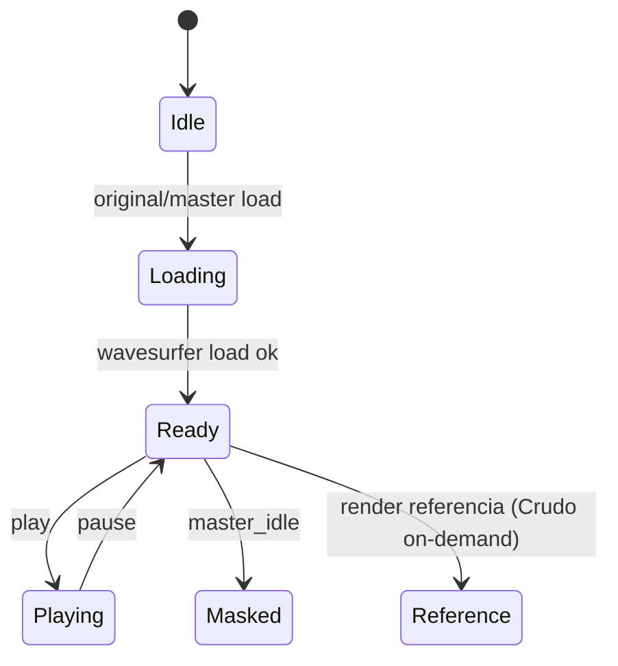
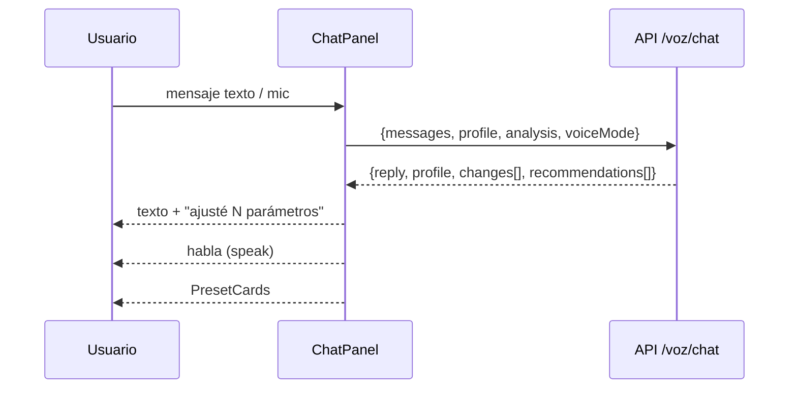

# Mapa de UX — Brikmaster Studio

> Estado del árbol: **septiembre 2026**. Documenta el flujo real de la UI, no la spec 04 (que quedó desactualizada en navegación).

## 1. Vista general de rutas

| Ruta | Pantalla | Guarda |
|---|---|---|
| `/` | Studio de mastering (upload → mastering) | `AuthGuard` (off por default) + `LicenseGuard` |
| `/login` | Login | `AuthGuard` (solo si `NEXT_PUBLIC_REQUIRE_AUTH=1`) |
| `/voz` | Flujo de intención por voz (2 pasos: subir → conversar) | — |
| `/lab` | Laboratorio de audio aislado (`InteractiveSequencer`) | — |

```mermaid
flowchart LR
    subgraph App["App Shell (/, login, /voz, /lab)"]
        AG[AuthGuard<br/>off por default] --> LG[LicenseGuard<br/>loading → locked | unlocked]
    end
    LG --> ROOT
```

## 2. Flujo principal (`/`)



**Estados del upload:**



## 3. MasteringView — navegación por dock

El **ModuleDock** flotante (abajo-centro) es EL navegador de módulos. 10 módulos en dos grupos separados por tiles de telemetría.



**Dos modos de masterización (toggle Manual / Asistente IA):**



**Layout:**



## 4. Estados del Player (A/B)



- Fuentes: **Original / Referencia / Master** (`SourceKind`).
- A/B por capas de wave: transform-only, React controla opacity.
- Note burst por cada master que aterriza.

## 5. Live Engine (tab `live`)

```mermaid
flowchart LR
    Master[Master audio<br/>getAudioUrl(mastered)] --> Decode[decodeAudioData<br/>AudioContext efímero]
    Decode --> LV[LiveView<br/>2 columnas: FX + meters]
    LV --> FX[FxSlotPanel<br/>filtro · drive · delay · reverb]
    LV --> Meters[LiveMeters]
    LV --> Rec[LiveRecorderBar]
```

- Requiere **master previo** (empty state si no hay).
- Control standalone: los **knobs** (mouse/teclado, `Knob3D`) escriben `LiveParams` directo en el grafo Web Audio del navegador. No hay cámara, gestos ni WebSocket.
- Patrón React oficial de descarte de buffer: ajuste durante render (`decodedUrl !== masterAudioUrl`).

## 6. Chat del Asistente IA



- 9 ejes del `IntentProfile` (warmth, punch, clarity, brightness, width, bass_weight, vocal_focus, vintage, loudness) — **no se muestran** en UI, el usuario elige presets.
- Saludo hablado una sola vez (guard `welcomeSpokenRef`).
- Mic corta la voz del agente (para no grabarse a sí mismo).

## 7. Rutas auxiliares

- **`/voz`**: flujo de intención en 2 pasos (subir track → conversar). `speak()` en el drop, el navegador suele permitirlo por gesto del usuario; si bloquea, falla en silencio.
- **`/lab`**: `InteractiveSequencer` aislado del flujo de mastering.
- **`/login`**: `LoginScreen` — auth apagado por default (`NEXT_PUBLIC_REQUIRE_AUTH !== "1"`), flag de localStorage sin verificación de servidor.

## 8. Puertas (guards)

1. **`AuthGuard`**: off por default. Envuelve la raíz. Si `REQUIRE_AUTH=1`: redirige a `/login` si no hay flag `waveai-auth`.
2. **`LicenseGuard`**: `loading → locked | unlocked`. `checkLicense()` en mount contra `/license/status`. Dev sin key → unlocked gratis. Key en `sessionStorage` + header `X-License-Key`. States gestionados con GSAP fade (locked → unlocked).

## 9. Descubrimientos transversales

- `@/components/*` **resuelve** a `src/presentation/components/*` (tsconfig) → no hay capa legacy de component-dup real.
- Duplicación pendiente: `lib/` vs `shared/` vs `adapters/` vs `core/` vs `hooks/` vs `application/` (ver deuda técnica en reporte de estado).
- Overlays flotantes: **FloatingDeliveryPanel** (FAB derecha), **FloatingReportCard** (píldora izquierda), dock abajo. Filosofía: "nada crece, todo es overlay".
- Convex desconectado: provider passthrough (layout).
- Accesibilidad: `prefers-reduced-motion` respetado en fisheye (desactiva), revealWave, módulos; `aria-hidden` en capas ambientales.